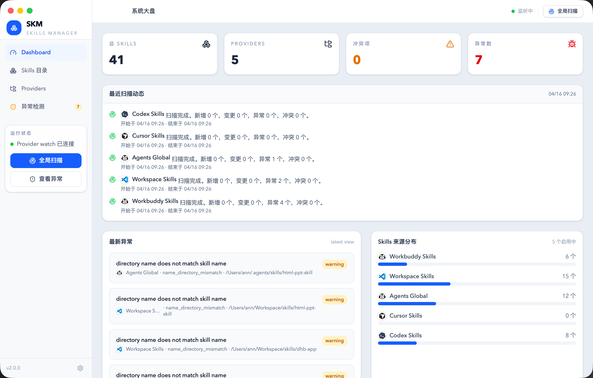
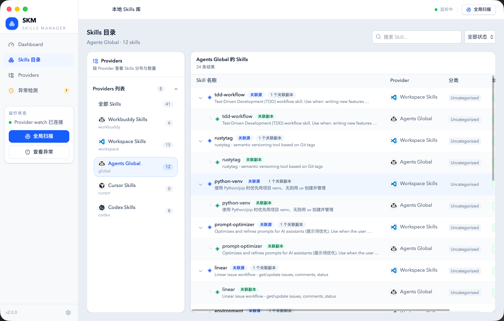

# SKM

[中文文档](README.zh-CN.md)

SKM is a local-first Skills Manager for scanning multiple providers, indexing `SKILL.md` metadata, identifying issues and conflicts, and managing everything through a web console and a macOS desktop app.

The project currently consists of three parts:

- Go backend: scanning, indexing, conflict detection, and REST APIs
- React frontend: dashboard, skill browsing, provider management, and issue views
- Wails desktop host: packages the application as a macOS desktop app

## Features

- Manage multiple local skill providers, including enable, disable, edit, and delete flows
- Scan skill directories and extract `SKILL.md`, frontmatter, directory trees, and text file content
- Visualize scan history, latest issues, conflict groups, and dashboard metrics
- Attach skill content to another provider and track `.to` and `.from` metadata
- Support both browser-based development and a macOS desktop runtime

## Preview

### Dashboard



The dashboard surfaces provider counts, skill totals, latest issues, scan activity, and provider distribution in a single operational view.

### Skills Catalog



The skills catalog groups entries by provider, exposes related attached copies, and keeps browsing, filtering, and provider context in the same page.

## Design

SKM is not intended to be a generic file browser. It is designed as an operating surface for skill-directory workflows. The current design focuses on three goals:

- Make scattered local skill providers discoverable, comparable, and maintainable in one place
- Put `SKILL.md`, directory structure, scan results, and conflict signals into the same interface
- Share one core capability set across web and desktop so the product does not split into two separate implementations

Product decisions currently follow these principles:

- Local-first: optimized for local directories, SQLite, and a low-friction developer workflow
- Inspectable: scan results, issues, and file content should remain traceable and explainable
- Incremental: solidify providers, scanning, conflicts, and attach flows before expanding into heavier collaboration features
- Reusable: keep backend, frontend, and desktop host aligned on data models and API contracts

## Architecture

```text
skm/
├── backend/    # Go API service and scanner
├── frontend/   # React + Vite web UI
├── build/      # Desktop build output
├── main.go     # Wails desktop entry
├── wails.json  # Wails config
└── README.md
```

## Tech Stack

- Backend: Go 1.24, Gin, GORM, SQLite or PostgreSQL
- Frontend: React 19, TypeScript, Vite, Tailwind CSS v4, React Router v7, Vitest
- Desktop: Wails v2.12.0

## Quick Start

### Prerequisites

- Go 1.24+
- Node.js 20+
- pnpm 10+

### Run the full stack

```bash
make dev
```

Default endpoints:

- Backend: `http://localhost:8080`
- Frontend: `http://localhost:5173`

Use custom ports when needed:

```bash
BACKEND_PORT=18080 FRONTEND_PORT=4173 make dev
```

### Start with seeded providers

```bash
make dev/seed
```

This resets the local SQLite database, starts the backend and frontend, and seeds default provider records based on common skill directories found on the current machine.

### Run each part separately

Backend:

```bash
cd backend
cp .env.example .env
make run
```

Frontend:

```bash
cd frontend
make install
make dev
```

### Desktop development

```bash
make app-dev
```

### Build the macOS app

```bash
make app-build
```

The generated `.app` bundle is written to `build/bin/`.

If the desktop app is launched outside the repository working directory, SQLite resolves to `~/.skm/app.db` by default. Override it with `DB_DSN` when needed.

## Common Commands

```bash
make install       # Install frontend dependencies and preload Go modules
make dev           # Run backend and frontend together
make dev/seed      # Reset DB and start with seeded providers
make reset         # Remove local SQLite database files
make seed          # Seed default providers and exit
make test          # Run backend and frontend tests
make build         # Build backend binary and frontend assets
make cli-build     # Build the skm CLI binary
make cli-install   # Install the skm CLI to ~/.local/bin
make app-dev       # Run the Wails desktop app in dev mode
make app-build     # Build the macOS desktop app
```

## CLI

SKM also ships a CLI that uses the same database and backend services as the desktop app.

Build it:

```bash
make cli-build
```

Install it into `~/.local/bin`:

```bash
make cli-install
```

Commands:

```bash
skm version
skm dashboard
skm providers
skm providers add --name "Workspace Skills" --type workspace --root ~/Workspace/skills
skm providers update PROV0001 --priority 400 --description "main workspace provider"
skm providers delete PROV0001
skm skills --provider "Workspace Skills"
skm skills get SKIL0001
skm skills to --provider PROV0002 --include README.md --include scripts/** --exclude plugins/**
skm skills link SKIL0001 --to PROV0002
skm skills move SKIL0001 --to PROV0003
skm skills sync SKIL0002
skm skills delete SKIL0002
skm issues --view latest
skm scan all
skm scan provider PROV0001
```

In the desktop app, the sidebar runtime card also exposes an `Install CLI` button. It installs the bundled CLI binary to `~/.local/bin/skm`.

## API Overview

Public endpoints:

```text
GET  /healthz
GET  /version
GET  /api/dashboard
```

Provider and scan endpoints:

```text
GET    /api/providers
POST   /api/providers
GET    /api/providers/:zid
PUT    /api/providers/:zid
DELETE /api/providers/:zid
POST   /api/providers/:zid/scan
POST   /api/scan
GET    /api/scan-jobs
GET    /api/scan-jobs/:zid
GET    /api/issues
GET    /api/issues?view=latest
GET    /api/conflicts
```

Skill endpoints:

```text
GET  /api/skills
GET  /api/skills?grouped=true
GET  /api/skills/:zid
POST /api/skills/:zid/attach
GET  /api/skills/:zid/files
GET  /api/skills/:zid/file-content?path=SKILL.md
```

See `docs/frontend-api-contract.md` for request and response examples.

## Configuration

Main runtime configuration lives in `backend/.env`:

- `PORT`: backend port, default `8080`
- `DB_DRIVER`: `sqlite` or `postgres`
- `DB_DSN`: database DSN, default `./data/app.db`
- `SEED`: seed default providers on startup
- `SEED_ONLY`: seed and exit

When running through Wails in development, the desktop host also reads `backend/.env`.

## Repository Guide

- Backend setup and API notes: `backend/README.md`
- Frontend setup and scripts: `frontend/README.md`
- Frontend API contract: `docs/frontend-api-contract.md`
- Product notes: `docs/PRD.md`

## Contributing

Issues and pull requests are welcome.

- Bug reports: include reproduction steps, expected behavior, actual behavior, and logs or screenshots when relevant
- Feature proposals: explain the user problem first, then the proposed interaction or API shape
- Pull requests: keep scope focused, update docs when behavior changes, and include validation steps

See `CONTRIBUTING.md` for the contribution workflow.

## Acknowledgements

SKM builds on top of excellent open source projects. Special thanks to:

- Wails for the desktop host and web-to-desktop integration model
- Gin and GORM for the Go-side HTTP and data access foundations
- React and Vite for the frontend architecture and development workflow
- Tailwind CSS, Radix UI, and shadcn/ui for UI building blocks
- Lucide, GSAP, Motion, and Zustand for icons, animation, and interaction state management

The project is also inspired by local-first toolchains and skill-directory workflows, especially the idea of using `SKILL.md` as a capability unit, directories as distribution units, and conflict visibility as a first-class feature.

## License

MIT. See `LICENSE`.
