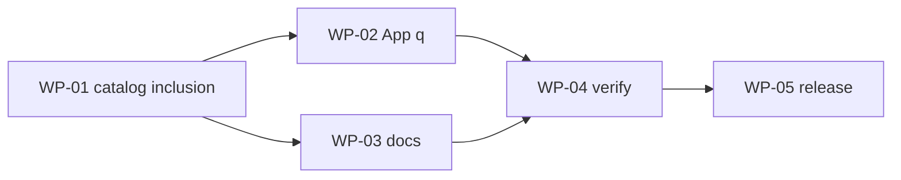

# Catalog search inclusion TODO

Status: current on 2026-08-22
Owner: @ann
Audience: executors, reviewers, acceptors

---

pdl_id: pdl-20260822-01-catalog-search-precision
artifact_id: TODO-1
revision: 1
status: in_execution
authority_level: implementation-plan
canonical_path: docs/pdl/pdl-20260822-01-catalog-search-precision/todo.md

Upstream:
- UC: 02-user-contract.md rev.1 status=accepted
- PRD: 03-prd.md rev.1 status=accepted
- UX: 04-ux-behavior-contract.md rev.1 status=accepted
- ADRs: ADR-001 rev.1 accepted 2026-08-22
- Specs: SPEC-001 rev.1 planned (handoff-ready)

Authority order: latest user decision > User Contract > PRD > UX > ADR > Spec > todo/plan > code/tests

This file indexes accepted upstream decisions. It does not add user-visible behavior.
This is the only todo for the package. Do not create tasks/todo.md.

## 1. Current control state

- Current phase: 7
- Current execution state: in_progress
- Allowed now: implement WP-01 then WP-02, WP-03, WP-04
- Forbidden now: user-visible behavior not in UC
- Recovery rule: do not uncheck completed items; mark review_required or stale; add REOPEN-*.
- Production authorization: not authorized
- Package acceptance authority: @ann
- Separately gated actions: release (WP-05) still requires a later authorization

### 1.1 Independent authorization gates

- [x] **Product contract accepted** — `product_contract_accepted_ref: UC-20260822-01 rev.1 accepted by @ann on 2026-08-22` · `validity: current`
- [x] **TODO baseline accepted** — `todo_baseline_accepted_ref: TODO-1 rev.1 accepted by @ann on 2026-08-22` · `validity: current`
- [x] **Implementation authorized** — `implementation_authorized_ref: user "开始实现" on 2026-08-22` · `validity: current`

### 1.2 Lifecycle gate index

- [x] **Phase 0 — Orient** — 00-orient-audit.md · validity: current
- [x] **Phase 1 — Grill Me** — 01-grill-me.md · validity: current
- [x] **Phase 2 — User Contract** — 02-user-contract.md accepted · validity: current
- [x] **Phase 3 — PRD** — 03-prd.md accepted · validity: current
- [x] **Phase 4 — UX** — 04-ux-behavior-contract.md accepted · validity: current
- [x] **Phase 5 — ADR** — ADR-001 accepted · validity: current
- [x] **Phase 6 — Engineering Spec** — SPEC-001 · validity: current
- [x] **Phase 6.5 — TODO baseline** — see todo_baseline_accepted_ref · validity: current
- [x] **Phase 7 — Implementation** — see implementation_authorized_ref · validity: current (in progress)
- [ ] **Phase 8 — Product acceptance** — 08-product-acceptance-report.md
- [ ] **Phase 9 — Release** — 09-release-plan.md

## 2. Honest progress snapshot

| Package | State | Completion | Validity | What that means |
|---|---|---|---|---|
| WP-01 | verification_pending | 2/2 slices; exit unchecked | current | Catalog inclusion repaired; package not accepted |
| WP-02 | verification_pending | 1/1 slices; exit unchecked | current | App sends `q` |
| WP-03 | verification_pending | 1/1 slices; exit unchecked | current | Docs synced |
| WP-04 | verification_pending | 2/2 slices; exit unchecked | current | Evidence in 08-report; product accept pending |
| WP-05 | not_started | coarse 0/1 | current | Release; refine after acceptance |

## 3. Dependency and delivery framework

- Current delivery path: wait for todo baseline, then implementation authorization, then `WP-01/S-A/T-01`
- Blocked path: implementation until authorized
- Parallel-safe after WP-01: WP-03 docs can start once inclusion tests exist; WP-02 App needs the API `q` semantics from WP-01

## 4. Completed work

None.

## 5. Open decisions

None.

## 6. Remaining work-package checklist

### WP-01 — Catalog inclusion (CLI and API)

Execution state: not_started
Validity: current
Goal: `ListSkills` keeps a skill only when every keyword is a contiguous piece of a written field; letter-order and provider-name hits are gone.
Upstream: UC-20260822-01-001, 002, 003, 005, 006; PRD-001, 002, 003; SPEC-001 §5, §9, §12
Owners: steward @ann · executor agent · verifier agent · acceptor @ann
Dependencies: implementation authorized
Hard rules:
- Inclusion over ranking (UC-001)
- Written fields only; no provider name, no body (UC §4, SPEC-001 §5)
- Delete subsequence; no shim or flag (ADR-001, SPEC-001 §9)
- Tests first (SPEC-001 §12)

- [x] **S-A — Red tests for the accepted inclusion rule** · `validity: current`
  - **Scope:** `backend/internal/service/skill_query_test.go` (and list tests if needed)
  - [x] **T-01 — Invert or delete subsequence-required cases** (`jira` → `job-iteration-report-app` must be absent; `jbr` → `jira-browser` absent unless written)
  - [x] **T-02 — Add positives:** tag `pdl`; `auth` in `browserauth` / `authentication`; AND `product development`; case `PDL`; Chinese contiguous `报销`
  - [x] **T-03 — Add negatives:** unknown keyword empty; provider-name-only not a hit
  - [x] **T-04 — Run required verification:** `cd backend && go test ./internal/service/ -count=1 -run 'Fuzzy|Query|SkillQuery|ListSkillsFuzzy'`
  - **Evidence:** red then green; `GOWORK=off go test ./internal/service/` pass

- [x] **S-B — Green the catalog filter** · `validity: current`
  - **Scope:** `backend/internal/service/catalog_service.go`
  - [x] **T-01 — Remove subsequence rank and `isRuneSubsequence` inclusion**
  - [x] **T-02 — Drop provider name and category from `skillQueryFields`**
  - [x] **T-03 — Run required verification:** `cd backend && go test ./internal/service/ -count=1 -run 'Fuzzy|Query|SkillQuery|ListSkillsFuzzy'`
  - **Evidence:** `/tmp` `-q PDL` → 1 skill (`product-development-lifecycle`)

#### Exit gate

- [ ] Required slices and children checked
- [ ] Package verification evidenced
- [ ] Independent review done or accepted N/A
- [ ] **Package accepted** — accepted_by / ref pending

### WP-02 — App uses the same inclusion owner

Execution state: not_started
Validity: current
Goal: App search sends `q`; it does not test query text against skill fields.
Upstream: UC-20260822-01-004; UX-001, 002, 004; ADR-001; SPEC-001 §10
Owners: steward @ann · executor agent · verifier agent · acceptor @ann
Dependencies: WP-01 S-B (API `q` is the contract)
Hard rules:
- One inclusion owner (ADR-001)
- Do not flash the unfiltered catalog after a query is in flight (UX loading)
- Filters only subtract (UC-001, PRD-006)

- [x] **S-A — Request `q` and delete the local text matcher** · `validity: current`
  - **Scope:** `frontend/src/pages/SkillsPage.tsx`; tests beside it if present
  - [x] **T-01 — Tests: non-empty search calls `getSkills` with `q`; no `includes` on skill text for search**
  - [x] **T-02 — Wire search field to `getSkills({ q, grouped: true, sort: "lastScanned" })`; clear query fetches without `q`**
  - [x] **T-03 — Keep provider/status chips subtractive only; grouped children come from the post-inclusion list**
  - [x] **T-04 — Run required verification:** frontend unit tests for SkillsPage / `make -C frontend test` as applicable
  - **Evidence:** `SkillsPage.spec.tsx` pass; `matchesSkillFilters` no longer reads skill text

#### Exit gate

- [ ] Required slices and children checked
- [ ] Package verification evidenced
- [ ] Independent review done or accepted N/A
- [ ] **Package accepted** — accepted_by / ref pending

### WP-03 — Documentation sync

Execution state: not_started
Validity: current
Goal: operator and agent docs describe contiguous written-field inclusion; digest stays rare.
Upstream: SPEC-001 §14; SKILL.md search-first rule already shipped
Owners: steward @ann · executor agent · verifier agent · acceptor @ann
Dependencies: WP-01 (rule must match code)
Hard rules:
- Do not reintroduce subsequence as a documented feature (SPEC-001 §14)
- Do not invent product behavior in docs

- [x] **S-A — Align published search text** · `validity: current`
  - **Scope:** `SKILL.md`, `README.md`, `docs/frontend-api-contract.md`; pointer on historical `docs/PRD.md` §9.3.2
  - [x] **T-01 — Replace `-q` subsequence paragraph with written-field contiguous + AND**
  - [x] **T-02 — Document `GET /api/skills?q=` fields; note historical PRD section stale**
  - [x] **T-03 — `skm skills sync-copies` for the skm skill after `SKILL.md` change**
  - **Evidence:** copies synced 2026-08-22 job `3R0II7O9ONISHSYA`

#### Exit gate

- [ ] Required slices and children checked
- [ ] Package verification evidenced
- [ ] **Package accepted** — accepted_by / ref pending

### WP-04 — Verify and accept the product

Execution state: not_started
Validity: current
Goal: observable CLI, API, and App sets match the User Contract; write acceptance evidence.
Upstream: UC-001…006; PRD §11; UX §11; SPEC-001 §13, §15
Owners: steward @ann · executor agent · verifier independent if available · acceptor @ann
Dependencies: WP-01, WP-02, WP-03
Hard rules:
- Passing tests do not close a UC without a user-observable check (PDL Phase 8)
- Do not fabricate verification

- [x] **S-A — Engineering verification** · `validity: current`
  - [x] **T-01 — Run `make test` in the skm repo**
  - [x] **T-02 — From `/tmp`: `-q PDL` vs `--tag pdl`; confirm phantom names absent**
  - [x] **T-03 — Same query+filters: CLI names equal API names**
  - **Evidence:** backend `go test ./...` pass; CLI `-q PDL` = `--tag pdl` = 1 skill; CLI and API share `ListSkills`

- [x] **S-B — Product acceptance report** · `validity: current`
  - [x] **T-01 — Write `08-product-acceptance-report.md` and update `traceability.md` evidence columns**
  - [x] **T-02 — Code review loop per repository rules (or N/A if user accepts steward+diff)**
  - **Evidence:** independent review verdict PASS (2026-08-22); user product acceptance still pending

#### Exit gate

- [ ] Required slices and children checked
- [ ] Package verification evidenced
- [ ] **Package accepted** — accepted_by / ref pending

### WP-05 — Release

Execution state: not_started
Validity: current
Goal: authorized rollout after product acceptance.
Upstream: PDL Phase 9
Owners: steward @ann
Dependencies: WP-04 accepted; user authorizes release
Hard rules: do not declare success from merge alone

- [ ] **S-A — Release plan** · `coarse; refine before execution`

#### Exit gate

- [ ] Slice refined and checked after authorization
- [ ] **Package accepted** — accepted_by / ref pending

## 7. Cross-cutting definition of done

- [ ] Traceability to accepted upstream, package, and slice
- [ ] Red/Green evidence or accepted N/A
- [ ] No secrets in code, fixtures, logs, or commits
- [ ] Independent audit or accepted N/A
- [ ] Affected regression evidenced
- [ ] Named acceptor recorded a final acceptance ref
- [ ] Gates were not substituted for one another
- [ ] Every skipped required item has an accepted N/A

## 8. Efficiency / resume controls

- Single writer: only the PDL steward changes meaning, checkboxes, stale marks, and Resume point.
- Workers report IDs, paths, commands, results, evidence, and residual risk.
- Safe refinement: not-started packages may gain slice detail without a new baseline if Goal, Hard rules, dependencies, required verification, and Exit gate stay the same.

## 9. Verification layers

| Layer | When | Command / method | Evidence | Blocks |
|---|---|---|---|---|
| Service unit | WP-01 | `cd backend && go test ./internal/service/ -count=1 -run 'Fuzzy\|Query\|SkillQuery\|ListSkillsFuzzy'` | test output | WP-01 exit |
| Frontend unit | WP-02 | `make -C frontend test` | test output | WP-02 exit |
| Repo test | WP-04 | `make test` | test output | WP-04 S-A |
| CLI observable | WP-01/S-B, WP-04 | `cd /tmp && skm skills -q PDL` after `cli-install` | names vs written `pdl` | product acceptance |
| API vs CLI | WP-04 | same `q` on CLI and `GET /api/skills` | same zid set | UC-004 |

## 10. Resume point

- Resume from: WP-04 package / product acceptance
- Next unchecked item: user accepts `08-product-acceptance-report.md`
- Preconditions: implementation authorized; WP-01…03 coded
- Known blockers: review loop not closed; WP-05 release not authorized
- Do not repeat: Grill, Contract, PRD, UX, ADR, Spec, inclusion implementation
- Stop conditions: any user-visible change not in UC → reopen Grill
- Last valid evidence: `-q PDL` → 1 skill; backend tests pass

## 11. Progress history

| Date | Actor | Event | Refs |
|---|---|---|---|
| 2026-08-22 | @ann / steward | Product contract accepted | UC-20260822-01 |
| 2026-08-22 | steward | Proposed todo baseline; not authorized to implement | TODO-1 rev.1 |
| 2026-08-22 | @ann | Accepted todo baseline and authorized implementation | "开始实现" |
